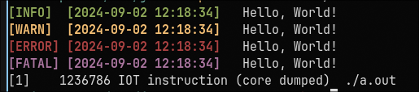

# jello

A tiny single file header only logging library for C++23

This library makes use of std::print and std::format so make sure your compiler supports this!

## Example

```cpp
// this is optional, will default to logging everything and not writing to log files
jello::configure(
    jello::Level::Info, // the debug message will no longer be shown :)
    "./test.log"        // the logs are now also printed to a file
);

jello::debug("Hello, World!");
jello::info("Hello, World!");
jello::warning("Hello, World!");
jello::error("Hello, World!");
jello::fatal("Hello, World!");
```



<details>
<summary>Example: Overwrite raylib logging</summary>

```cpp
SetTraceLogCallback([](int message_type, const char* text, va_list args) {
    std::vector<char> buffer(1024);
    auto size = vsprintf(buffer.data(), text, args);
    std::string log_str {buffer.begin(), buffer.begin() + size};

    switch (message_type) {
    case LOG_TRACE:
        jello::debug("TRACE {}", log_str);
        break;
    case LOG_DEBUG:
        jello::debug(log_str);
        break;
    case LOG_INFO:
        jello::info(log_str);
        break;
    case LOG_WARNING:
        jello::warning(log_str);
        break;
    case LOG_ERROR:
        jello::error(log_str);
        break;
    case LOG_FATAL:
        jello::fatal(log_str);
        break;
    }
});
```

</details>

## Install

Just copy the file into your project and adjust accordingly

## License

BSD 0-Clause
